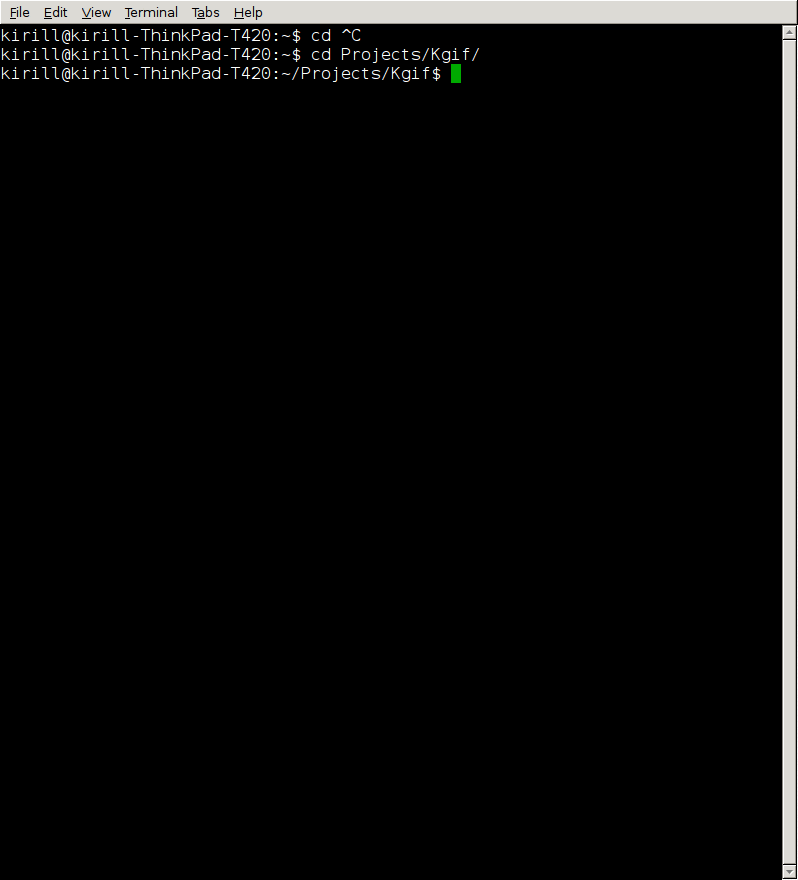

[](https://www.fbi.gov/)
[](https://en.wikipedia.org/wiki/Software_bug)

Kgif
======

Tool for creating gif file from capturing active window.


Originally it was created for capturing tty output and creating preview for github projects :wink:


I needed to capture tty output on my Ubuntu 15.10. First I came up to using ```ttyrec``` with [ttygif](https://github.com/icholy/ttygif) or [tty2gif](https://bitbucket.org/antocuni/tty2gif) convertor, then find [showterm.io](http://showterm.io/). All this solutions didn't work for me :grimacing: Than I create this simple script that satisfies all my needs.

### Dependencies

* scrot
* imagemagick


### Installation

```bash
$ sudo apt-get install imagemagick && sudo apt-get install scrot
$ git clone https://github.com/luminousmen/Kgif
```

### Usage

```bash
$ ./kgif.sh --help
usage: ./kgif.sh [--delay] [--filename ] [--gifdelay] [--noclean] [--check] [-h]
  -h, --help                   Show this help, exit
      --check                  Check if all dependencies are installed, exit
      --delay=<sec>            Set delay in seconds to specify how long script will wait until start capturing.
      --gifdelay=<sec>         Set delay in seconds to specify how fast images appears in gif.
      --filename=<file name>   Set file name for output gif.
      --noclean                Set if you don't want to delete source *.png screenshots.

```


Set ```delay``` in seconds to specify how long script will wait until start capturing.
```bash
$ ./kgif.sh --delay=5
```

Set ```noclean``` if you don't want to delete source png screenshots (for example if you want to delete some of the screenshots).
```bash
$ ./kgif.sh --delay=5 --noclean
```

### Preview


